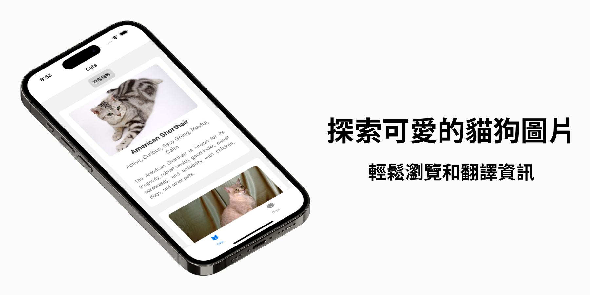
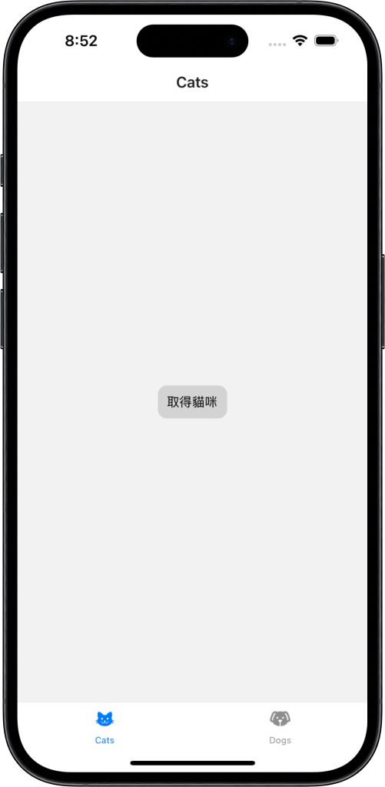
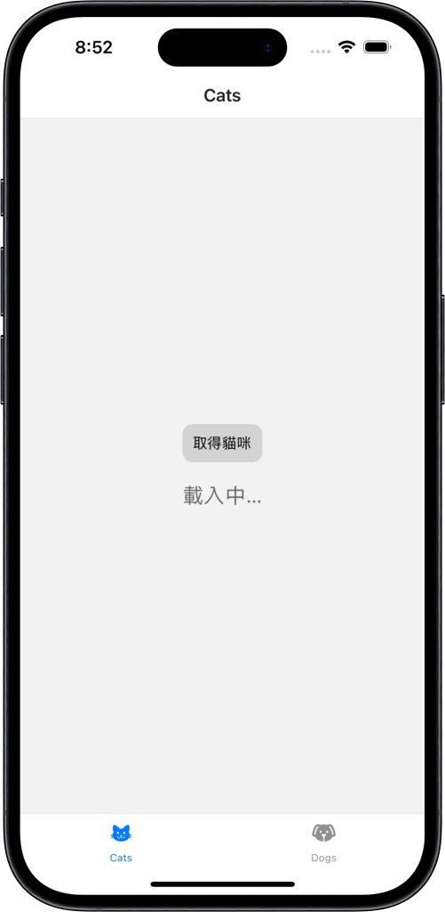
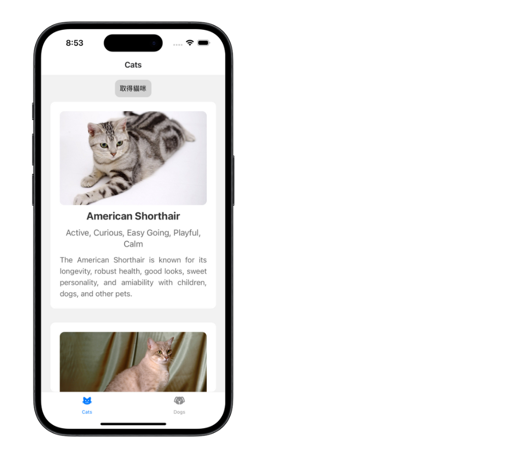
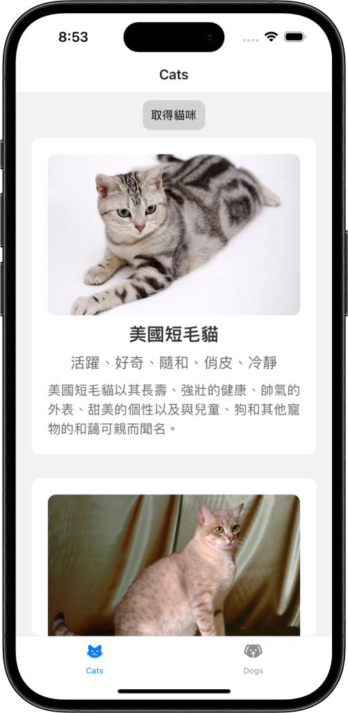
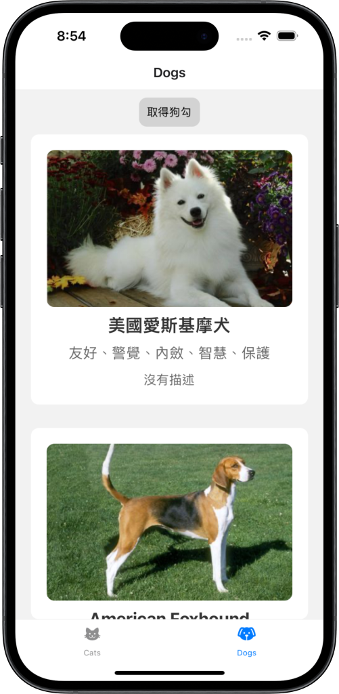

# 動物應用程式 🐱🐶

此專案於 2024 年 4 月製作

「動物應用程式」讓使用者透過點擊按鈕，一鍵取得貓咪和狗狗的圖片與資訊，並搭配 Azure 翻譯 API，讓中文使用者也能夠了解英文的資訊。

## 專案展示 🖥

### App Demo

### 起始畫面

### 貓狗資訊

### 翻譯功能

## 使用技術 🔧

- **JavaScript**：負責邏輯撰寫

- **React Native**：製作前端畫面，並透過 Hook 管理狀態及 Context API 管理全域狀態

- **React Navigation**：製作底部導航列，跳轉貓和狗頁面

- **axios**：處理網路請求

- **The Cat / Dog API**：取得貓狗圖片與資訊

- **Azure API**：將英文資訊翻譯成中文

## 功能 🚀

- **取得資訊**：點擊按鈕取得貓狗圖片與資訊

- **翻譯功能**：將英文資訊翻譯成中文

- **外部連結**：點擊動物名稱連結至外部介紹網站

## 執行方式 🏃

1. `git clone` 此專案至本機

2. `cd` 進入專案資料夾

3. `npm install` 安裝相關套件

4. `npm start` 啟動專案，並使用模擬器或手機安裝 Expo Go 開啟
